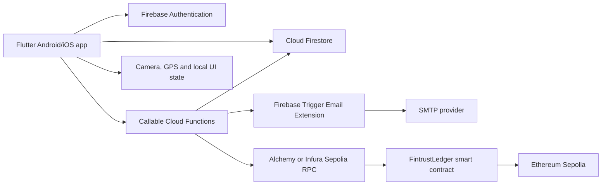
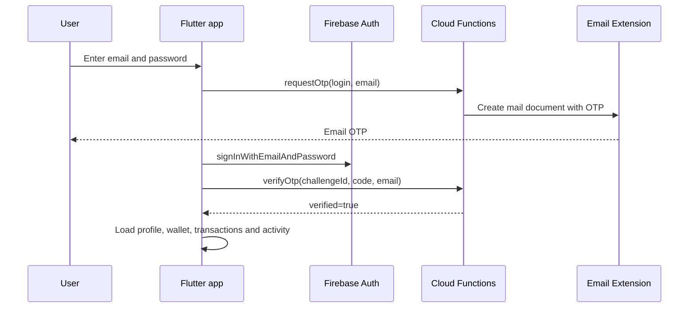
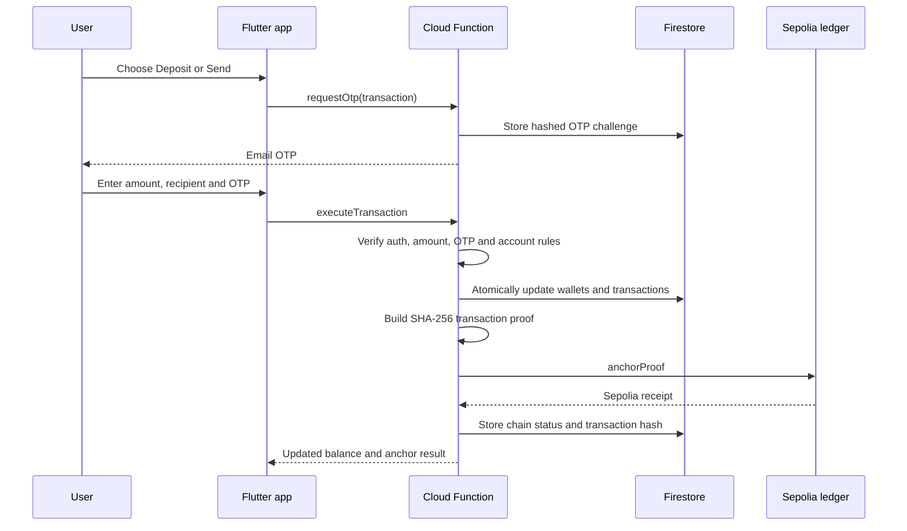

# FINTRUST: End-to-End Technical Description

FINTRUST is a Flutter mobile fintech application for Android and iOS. It combines Firebase Authentication, Cloud Firestore, callable Cloud Functions, email OTP, QR payments, reporting, and tamper-evident transaction records anchored to an Ethereum Sepolia smart contract.

This repository is a development and academic prototype. It uses the Sepolia testnet and application-managed wallet balances. It is not a licensed banking or payment service and must not be used with real customer funds without security, compliance, fraud, operations, and payment-provider review.

## Product Scope

The main user journey is:

1. Open the app and choose Login, Register, or Reset Password.
2. Sign in with email and password.
3. Request and enter a one-time login code delivered by email.
4. View the generated FINTRUST account number, balance, accounts, transactions, activity, reports, QR Pay, support, recommendations, dark mode, and location verification.
5. Request a new transaction OTP before depositing or sending money.
6. Let the trusted backend validate the OTP, update balances, create a transaction proof, and attempt blockchain anchoring.
7. Verify the resulting blockchain transaction hash on Sepolia Etherscan.

## System Architecture



The main code boundaries are:

- `lib/features/fintrust_screens.dart`: authentication, dashboard, transaction, QR, profile, support, activity, and report screens.
- `lib/services/fintrust_controller.dart`: session state, loading state, OTP state, theme state, and user actions.
- `lib/services/fintrust_backend.dart`: backend interface plus Firebase and demo implementations.
- `functions/index.js`: trusted OTP verification, balance changes, hashing, and blockchain anchoring.
- `blockchain/contracts/FintrustLedger.sol`: immutable transaction proof storage on Sepolia.

## Authentication Workflow



The server generates a six-digit OTP with Node.js cryptographic randomness. Only its SHA-256 hash is stored in `otpChallenges`. A challenge expires after five minutes and is consumed after successful verification. Transaction challenges are bound to the authenticated Firebase UID.

Registration creates a Firebase email/password account and a Firestore profile containing the generated account number, masked identity number, verification-factor labels, risk score, and credential commitment hash. A starter wallet and activity record are also created.

The registration form includes email, phone, identity-document, email-code, and authenticator-code fields. The current server-enforced OTP functions support `login` and `transaction` purposes. A production registration flow should add and enforce a dedicated `registration` challenge before account activation. Authenticator fields should be replaced with standards-based TOTP enrollment and verification.

Password reset calls Firebase Auth `sendPasswordResetEmail`. Logout calls Firebase Auth `signOut`. Plaintext passwords are never stored by the app.

## Transaction Workflow



### Deposit

The authenticated user requests a transaction OTP, enters a positive amount, and confirms. `executeTransaction` validates the OTP and increases the wallet balance inside a Firestore transaction. It creates a settled incoming transaction and activity event.

### Send

The user enters another FINTRUST account number and amount. The function validates the recipient through `accountDirectory`, prevents self-transfer, checks the sender balance, decreases the sender wallet, increases the recipient wallet, and creates paired outgoing and incoming records atomically.

### Receive

A recipient does not manually accept a transfer. A successful send credits the recipient wallet and creates an incoming transaction and activity event. The recipient can share their account number or Receive QR payload.

### QR Pay

`mobile_scanner` reads a QR code. FINTRUST QR payloads identify a recipient account and amount. The app shows a confirmation dialog, requests a transaction OTP, and routes the payment through the same server-side transaction function.

## Firestore Data Model

```text
users/{uid}
  fullName, email, phone, accountNumber, idType
  maskedIdNumber, country, trustedDeviceName
  joinedAt, riskScore, credentialHash, verificationFactors

users/{uid}/wallets/main
  balance, currency, updatedAt

users/{uid}/transactions/{transactionId}
  title, counterparty, amount, currency, direction
  status, category, occurredAt
  previousHash, transactionHash, blockIndex
  serverSignature, signedBy
  chainStatus, chainTxHash, chainContract, chainNetwork

users/{uid}/activity/{activityId}
  title, subtitle, iconKey, occurredAt, isCritical

accountDirectory/{accountNumber}
  uid, accountNumber, fullName, updatedAt

otpChallenges/{challengeId}
  purpose, email, uid, codeHash, consumed, expiresAt, createdAt

mail/{messageId}
  to, message.subject, message.text, message.html, createdAt
```

Firestore rules allow owners to read their own data and prevent clients from creating or updating transaction records and wallet balances directly. Callable Cloud Functions perform money movement.

## Cryptography and Blockchain

For each server-created transaction, the backend builds a canonical payload containing transaction values, timestamp, previous hash, and block index. It computes a SHA-256 `transactionHash`. The previous hash links each user transaction to the preceding record and makes unauthorized edits detectable.

The backend calls:

```solidity
anchorProof(
    string transactionId,
    bytes32 transactionHash,
    bytes32 previousHash,
    uint256 blockIndex
)
```

The contract is owner-controlled, stores each proof once, emits `ProofAnchored`, and records an on-chain timestamp. The backend stores the Sepolia receipt hash in Firestore.

Current deployment:

- Network: Ethereum Sepolia
- Contract: `0xdDD652A8Cb6D0D56AA7Ad157b10Ec839559B591C`
- Explorer: [FintrustLedger on Sepolia Etherscan](https://sepolia.etherscan.io/address/0xdDD652A8Cb6D0D56AA7Ad157b10Ec839559B591C)

This is blockchain anchoring, not a decentralized banking ledger. Firebase remains the application database and the Cloud Function signer remains the transaction authority. The private signer key must never be placed in Flutter code or Git.

## Application Features

- Firebase email/password authentication and password reset.
- Email OTP for login and transaction confirmation.
- Unique FINTRUST account number for each registered user.
- Own-account deposits and account-to-account transfers.
- QR scanning, payment confirmation, and Receive QR display.
- Home dashboard with balance, accounts, transactions, and quick actions.
- Profile editing, verification factors, risk score, and trusted device label.
- Activity and notification-style history.
- Support chat UI.
- Dark mode.
- Expense recommendation based on transaction data.
- Expense and earning visualisation.
- Summary, activity, and transaction reports with CSV and PDF generation.
- Current-location verification using device GPS permission.

Camera and GPS require runtime permissions and separate Android/iOS testing. Location and identity data should be minimized and governed by a privacy policy before production release.

## Reporting Module

The Transactions area calculates income, spending, category totals, and transaction counts from the loaded transaction list. It generates:

- Summary reports with balance, income, spending, and count.
- Transaction reports with dates, categories, status, counterparties, and amounts.
- CSV exports for spreadsheet analysis.
- PDF exports using the Flutter `pdf` package.

On Android, generated files are written to the app's external documents directory when available, commonly under:

```text
/storage/emulated/0/Android/data/com.fintrust.fintrust/files/
```

The exact location depends on Android version and storage provider. A production build should expose a share/save action so users can retrieve reports reliably.

## Technology Stack

| Area | Technology |
| --- | --- |
| Mobile UI | Flutter and Dart |
| Authentication | Firebase Authentication, email/password |
| Database | Cloud Firestore |
| Backend | Firebase callable Cloud Functions, Node.js 20 |
| Email OTP | Firebase Trigger Email Extension and SMTP |
| Cryptography | Node.js `crypto`, SHA-256, HMAC-SHA-256 |
| Blockchain | Solidity, Hardhat, ethers.js |
| Test network | Ethereum Sepolia |
| RPC | Alchemy or Infura |
| QR | `mobile_scanner`, `qr_flutter` |
| Location | `geolocator` |
| Reports | Dart `pdf`, CSV, `path_provider` |

## Local Setup

### Prerequisites

Install Flutter, Android Studio with an SDK and emulator or USB-debugging device, Node.js 20, Firebase CLI, and Git.

### Clone and run

```sh
git clone --branch codex/fintrust-app https://github.com/ZabirSaleh/fintrust_flutter.git
cd fintrust_flutter
flutter pub get
flutter analyze
flutter test
flutter run
```

### Firebase setup

1. Select the Firebase project configured in `.firebaserc`.
2. Enable Authentication > Sign-in method > Email/Password.
3. Confirm Android package `com.fintrust.fintrust` and iOS bundle ID `com.fintrust.fintrust`.
4. Confirm `lib/firebase_options.dart`, `android/app/google-services.json`, and `ios/Runner/GoogleService-Info.plist` belong to the intended project.
5. Create Firestore and deploy rules and indexes:

```sh
firebase login
firebase use myr-ewallet
firebase deploy --only firestore
```

6. Install and configure Firebase Trigger Email Extension with a real SMTP sender. The extension watches the `mail` collection. SMTP credentials belong in extension configuration.

### Environment variables

Copy the examples into local files and replace placeholders. Keep them untracked:

```text
functions/.env
blockchain/.env
```

`functions/.env`:

```text
SEPOLIA_RPC_URL=https://eth-sepolia.g.alchemy.com/v2/YOUR_ALCHEMY_KEY
BLOCKCHAIN_PRIVATE_KEY=YOUR_SEPOLIA_SIGNER_PRIVATE_KEY
FINTRUST_LEDGER_ADDRESS=0xdDD652A8Cb6D0D56AA7Ad157b10Ec839559B591C
FINTRUST_SIGNING_SECRET=YOUR_LONG_RANDOM_SECRET
```

`blockchain/.env` is used by Hardhat and contains `SEPOLIA_RPC_URL` and `PRIVATE_KEY`. Use a dedicated development wallet funded only with Sepolia test ETH. Never use a personal or production wallet.

## Backend Deployment

```sh
cd functions
npm install
npm run lint
cd ../blockchain
npm install
npm run compile
npm run deploy:sepolia
cd ..
firebase deploy --only functions,firestore
```

After redeploying the contract, update `FINTRUST_LEDGER_ADDRESS` in `functions/.env` and redeploy Functions. The Functions signer needs RPC access and Sepolia test ETH.

## End-to-End Test Plan

| Test | Expected result |
| --- | --- |
| Register with a new email | Firebase user, profile, account number, wallet, and activity are created |
| Request login OTP | Hashed challenge is created and email is delivered through the extension |
| Login with correct OTP | Dashboard data loads |
| Incorrect or expired OTP | Request is rejected and cannot be reused |
| Reset password | Firebase sends a reset link |
| Deposit with transaction OTP | Balance increases and settled transaction appears |
| Send to valid second account | Sender decreases, recipient increases, paired records appear |
| Unknown recipient or insufficient balance | Operation is rejected with no balance change |
| Reuse a transaction OTP | Operation is rejected |
| Scan and pay with QR | Recipient and amount are shown, then OTP is required |
| Activity screen | Login, deposit, send, receive, and QR events appear |
| CSV/PDF export | Report is generated in the app documents directory |
| Dark mode | Theme changes without changing data |
| Location verification | GPS permission is requested and location is displayed |
| Firestore wallet update from client | Write is denied by Firestore rules |
| Blockchain verification | `chainTxHash` opens a successful Sepolia transaction containing the proof call |

For blockchain verification, open `chainTxHash` on [Sepolia Etherscan](https://sepolia.etherscan.io/). Confirm the contract address, successful status, sender, input data, and `ProofAnchored` event. The hash proves the proof was submitted; it does not prove that the off-chain balance is backed by real money.

## Security and Production Work

The current code demonstrates a server-controlled, zero-trust-style workflow. Before production, implement and independently review:

- Registration email verification and server-enforced registration OTP.
- Standards-based TOTP authenticator enrollment and verification.
- OTP rate limits, attempt counters, lockouts, replay protection, and abuse monitoring.
- A proper payment or banking ledger with double-entry accounting.
- Idempotency keys to prevent duplicate transfers on retries.
- Dedicated KYC provider and encrypted identity-document storage.
- Managed secret or HSM storage with key rotation.
- App Check, device attestation, monitoring, alerts, backups, and recovery.
- Blockchain queueing, retry handling, nonce management, gas monitoring, and reconciliation.
- Penetration testing, privacy review, regulatory assessment, and release signing.

## Repository Structure

```text
lib/
  main.dart
  firebase_options.dart
  features/fintrust_screens.dart
  services/fintrust_backend.dart
  services/fintrust_controller.dart
  widgets/fintrust_theme.dart

functions/
  index.js
  package.json
  .env.example

blockchain/
  contracts/FintrustLedger.sol
  scripts/deploy.js
  hardhat.config.js
  package.json
  .env.example

android/                  Android project and Firebase configuration
ios/                      iOS project and Firebase configuration
firestore.rules           Firestore authorization rules
firestore.indexes.json    Firestore query indexes
FINTRUST_Technical_Report.md
FINTRUST_End_to_End_Description.md
```

## Academic Value

FINTRUST demonstrates how a mobile fintech interface can combine managed cloud services with cryptographic integrity controls and public testnet anchoring. Firebase supplies authentication, persistence, server execution, and email delivery, while Sepolia supplies an independently verifiable timestamped proof. This clearly shows the difference between a conventional centralized fintech backend and a blockchain-backed audit trail.
