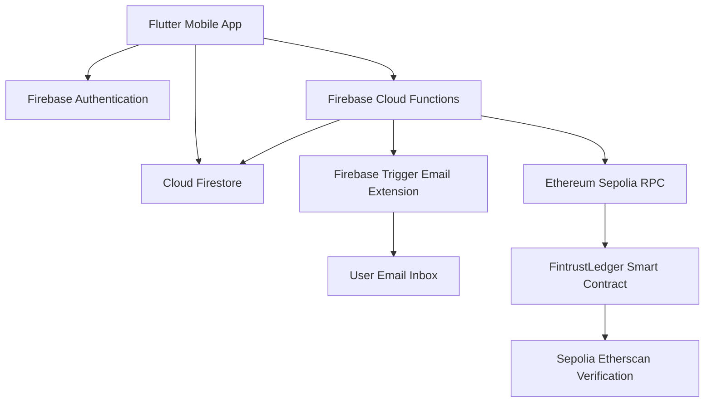
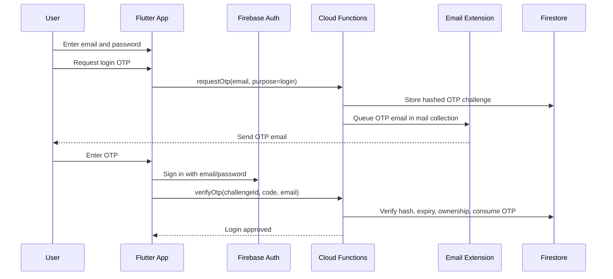
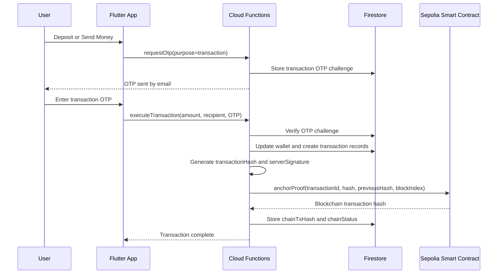

# FINTRUST Technical Report

## Introduction

FINTRUST is a secure cross-platform fintech mobile application developed with Flutter for Android and iOS. The application is inspired by modern digital banking and payment platforms such as Wise, Revolut, and PayPal, with a focus on clean user experience, secure authentication, transaction safety, reporting, and blockchain-based auditability.

The application supports user registration, login, profile management, email-based OTP verification, account generation, deposit, transfer, QR payment, reporting, activity monitoring, dark mode, support chat, AI-style spending recommendations, GPS security checks, and decentralized blockchain proof anchoring on Ethereum Sepolia.

FINTRUST uses Firebase as the main backend platform. Firebase Authentication manages email/password accounts, Cloud Firestore stores user and transaction data, Firebase Cloud Functions perform sensitive server-side operations, and Firebase Trigger Email sends OTP emails. For blockchain integration, FINTRUST deploys a Solidity smart contract to Ethereum Sepolia and anchors transaction proof hashes on-chain.

## Problem Statement & Objectives

Digital fintech applications handle sensitive identity, authentication, and transaction data. A weak architecture can expose users to account takeover, transaction fraud, data tampering, and poor auditability. Traditional mobile prototypes often keep transaction logic on the client side, which is risky because client-side code can be modified or bypassed.

FINTRUST addresses these risks by shifting sensitive transaction operations to Firebase Cloud Functions, enforcing OTP verification, hashing transaction records, and anchoring transaction proofs to a decentralized blockchain testnet.

The main objectives are:

- Build a secure mobile fintech application with a professional banking-style interface.
- Implement authentication, MFA, and OTP-based transaction authorization.
- Provide reliable transaction features including deposit, send, receive, QR payment, and activity tracking.
- Add reporting, business insight, and blockchain auditability for a stronger fintech prototype.

## Objectives

The project objectives are:

- Develop a Flutter mobile application that runs on both Android and iOS.
- Integrate Firebase Authentication, Firestore, Cloud Functions, and email OTP delivery.
- Generate a unique FINTRUST account number for every registered user.
- Enable core wallet operations: deposit, send, receive, and QR-based payment.
- Implement a tamper-evident transaction ledger using SHA-256 hashes.
- Anchor transaction proof hashes to Ethereum Sepolia using a deployed smart contract.
- Provide exportable CSV and PDF reports for transactions, activity, and summary insights.

## System Architecture / Workflow

FINTRUST follows a client-server architecture. The Flutter application handles UI and user interaction, while Firebase Cloud Functions handle sensitive backend logic. Firestore stores persistent records, and Sepolia blockchain stores decentralized transaction proof anchors.



### Authentication Workflow



### Transaction Workflow



## Technologies Used

### Frontend

- Flutter: Cross-platform mobile app framework.
- Dart: Main programming language for Flutter.
- Material Design components: Used for forms, navigation, cards, dialogs, and bottom sheets.
- Custom UI theme: Professional black, white, and blue fintech styling.

### Backend

- Firebase Authentication: Email/password registration, login, and password reset.
- Cloud Firestore: NoSQL database for users, wallets, account directory, transactions, activity, OTP challenges, and email queue.
- Firebase Cloud Functions: Secure server-side logic for OTP generation, OTP verification, transaction execution, ledger hashing, and blockchain anchoring.
- Firebase Trigger Email Extension: Sends OTP emails using SMTP.

### Security & Cryptography

- SHA-256 hashing: Used for credential commitments and transaction hashes.
- HMAC-SHA256 server signature: Used to sign transaction hashes.
- OTP challenge hashing: OTP codes are stored as hashes instead of plaintext.
- OTP expiry: OTP challenges expire after 5 minutes.
- One-time use: OTP challenges are consumed after successful verification.

### Blockchain

- Solidity: Smart contract programming language.
- Hardhat: Smart contract compile and deployment framework.
- ethers.js: Cloud Function library used to call the smart contract.
- Ethereum Sepolia: Public decentralized testnet used for proof anchoring.
- Sepolia Etherscan: External verification of blockchain transactions.

## Main Features

### Registration

Users can register with full name, email, phone number, ID type, ID number, password, email code, and authenticator code. After registration, Firebase creates the authenticated user, and Firestore stores the FINTRUST profile.

A unique account number is generated for each user using the Firebase user ID:

```text
FT-XXXX-XXXXXX
```

The account number is also stored in `accountDirectory`, allowing other users to send money by account number.

### Login

Login uses email/password plus email OTP. The user first requests an OTP, which is generated by Cloud Functions and sent through the Firebase email extension. The user then enters the OTP in the app.

The OTP is not stored as plaintext. Cloud Functions stores only:

```text
codeHash
purpose
email
uid
expiresAt
consumed
```

### Deposit

Deposit allows a user to add money to their own FINTRUST account. The transaction requires an email OTP before execution. The actual balance update is performed by Cloud Functions, not by the client app.

### Send Money

Send money allows a user to transfer funds to another FINTRUST account number. The backend validates:

- Recipient account exists.
- Sender is not sending to own account.
- Sender has sufficient balance.
- Transaction OTP is valid.

The sender receives an outgoing transaction record, and the recipient receives an incoming transaction record.

### Receive Money

Receive functionality shows the user account number and QR payment payload. Another user can send money to that account number.

### QR Payment

QR payment allows account and amount data to be encoded into a QR payload. The sender scans the QR code, confirms the transaction, requests email OTP, and completes payment.

## Key Features

### Zero Trust Authentication Concept

FINTRUST uses a zero-trust-inspired approach where each sensitive operation must be verified. Login requires password and email OTP. Transactions require a fresh transaction OTP. The app does not trust the mobile client alone for sensitive operations.

### Server-Side Transaction Control

Transaction execution is centralized in Cloud Functions. This prevents direct client-side manipulation of balances. The app sends transaction intent, but the backend validates and commits the transaction.

### Tamper-Evident Ledger

Every transaction contains:

```text
previousHash
transactionHash
blockIndex
serverSignature
```

The transaction hash is generated from transaction fields such as ID, title, amount, currency, direction, category, timestamp, previous hash, and block index.

This creates a blockchain-style internal ledger where modification of one transaction would break the hash chain.

### Decentralized Blockchain Anchoring

FINTRUST also anchors transaction proof hashes to Ethereum Sepolia. The deployed smart contract stores:

```text
transactionId
transactionHash
previousHash
blockIndex
timestamp
```

Sensitive user data is not stored on-chain. Only cryptographic proof hashes are written to Sepolia.

Deployed contract:

```text
0xdDD652A8Cb6D0D56AA7Ad157b10Ec839559B591C
```

Verification:

```text
https://sepolia.etherscan.io/address/0xdDD652A8Cb6D0D56AA7Ad157b10Ec839559B591C
```

## Add-On Feature(s)

### Push Notification Preview

The app requests Firebase Messaging permission and prepares notification token handling. If push setup is unavailable during testing, the app falls back gracefully with a notification preview.

### Support Admin Chat

The app includes a support chat interface where users can send support messages. A simulated admin reply is shown to demonstrate customer support workflow.

### Dark Mode

FINTRUST supports dark mode to improve usability and match modern fintech app expectations.

### AI Recommendation

The app analyzes recent income and outgoing transactions to provide spending recommendations. For example, it warns when outgoing payments exceed a high percentage of recent income.

### Data Visualization Dashboard

The dashboard summarizes income, expense, transaction counts, and activity counts. This helps users understand financial behavior quickly.

### Location / GPS Integration

The app can request location permission and capture GPS coordinates for security context. This can support future risk scoring and suspicious login detection.

## Reporting Module

FINTRUST includes a reporting module for financial and user activity analysis.

### Summary Report

The summary report includes:

- User name and account number.
- Current balance.
- Total earning.
- Total expense.
- Total transactions.
- User activity count.

### Transaction Report

The transaction report includes:

- Date.
- Title.
- Counterparty.
- Category.
- Direction.
- Amount.
- Status.

### User Activity Report

The activity report includes login events, transaction alerts, profile updates, QR scans, support messages, and security-related actions.

### Export to CSV

The CSV export is saved as:

```text
fintrust_transaction_report.csv
```

### Export to PDF

The PDF export is saved as:

```text
fintrust_summary_report.pdf
```

On Android emulator, both are saved in the app document directory:

```text
/data/user/0/com.fintrust.fintrust/app_flutter/
```

To copy them to the project folder:

```powershell
cmd /c "%LOCALAPPDATA%\Android\Sdk\platform-tools\adb.exe exec-out run-as com.fintrust.fintrust cat app_flutter/fintrust_transaction_report.csv > fintrust_transaction_report.csv"
cmd /c "%LOCALAPPDATA%\Android\Sdk\platform-tools\adb.exe exec-out run-as com.fintrust.fintrust cat app_flutter/fintrust_summary_report.pdf > fintrust_summary_report.pdf"
```

## Business Insight

FINTRUST provides several business values:

- Improved security: Email OTP, server-side transaction validation, and hashed OTP challenges reduce account takeover and transaction fraud risk.
- Better auditability: Firestore transaction chains and Sepolia blockchain anchoring provide tamper-verifiable transaction proof.
- User confidence: Users can see transaction history, activity logs, and blockchain anchor status.
- Operational reporting: CSV and PDF exports support financial review, compliance-style reporting, and transaction analysis.
- Scalable architecture: Firebase services allow rapid development while Cloud Functions protect sensitive operations.

The AI-style recommendation module supports financial behavior awareness. It calculates income and expense patterns and gives simple guidance, such as reducing discretionary spending when outgoing transactions become too high.

## Appendix

### Firebase Collections

Important Firestore collections:

```text
users
accountDirectory
otpChallenges
mail
transactions
activity
```

User-specific subcollections:

```text
users/{uid}/wallets/main
users/{uid}/transactions
users/{uid}/activity
```

### Cloud Functions

Main deployed functions:

```text
requestOtp
verifyOtp
executeTransaction
```

`requestOtp` generates OTP challenges and queues email delivery.

`verifyOtp` validates login OTP challenges.

`executeTransaction` validates transaction OTP, updates wallet balances, creates transaction records, signs hashes, and anchors proofs to Sepolia.

### Smart Contract

Contract name:

```text
FintrustLedger
```

Main function:

```solidity
anchorProof(
    string transactionId,
    bytes32 transactionHash,
    bytes32 previousHash,
    uint256 blockIndex
)
```

Only the deployer wallet can call `anchorProof`, which prevents unauthorized blockchain proof creation.

### Local Development Commands

Run Flutter app:

```bash
flutter run
```

Analyze app:

```bash
flutter analyze
```

Run tests:

```bash
flutter test
```

Build debug APK:

```bash
flutter build apk --debug
```

Deploy Firebase Functions:

```powershell
firebase deploy --project myr-ewallet --only functions
```

Compile blockchain contract:

```bash
cd blockchain
npm run compile
```

Deploy blockchain contract:

```bash
cd blockchain
npm run deploy:sepolia
```

### End-to-End Testing Checklist

- Register user.
- Login with email OTP.
- Reset password.
- Deposit with transaction OTP.
- Send money to another account.
- Receive money.
- Generate QR payment.
- Export CSV report.
- Export PDF report.
- Confirm Firestore transaction records.
- Confirm `chainStatus: anchored`.
- Open `chainTxHash` in Sepolia Etherscan.

### Security Notes

- Do not expose MetaMask private keys.
- Do not commit `.env` files.
- Do not store sensitive user details on blockchain.
- Use test wallets only for Sepolia.
- Rotate exposed API keys if screenshots contain RPC URLs.

